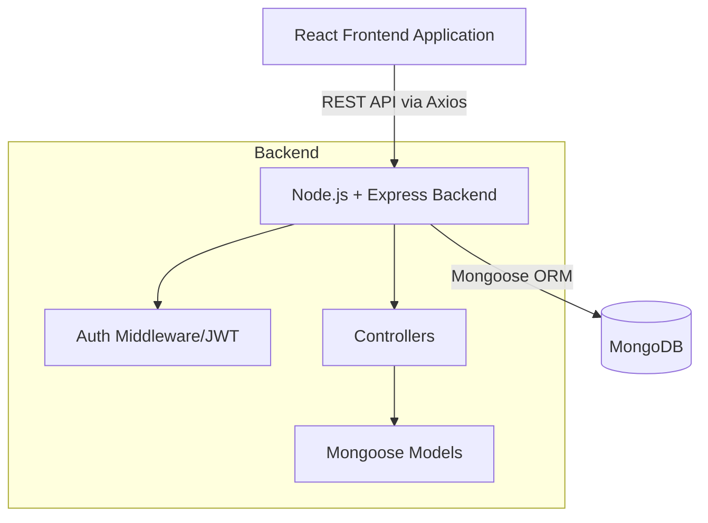

# Sports Tournament Management System

A full-stack, comprehensive web application designed to streamline the organization, scheduling, and management of sports tournaments. This system provides distinct portals for administrators and team captains to handle everything from team registration to match tracking and live leaderboards.

## Overview

The Sports Tournament Management System is built with a modern tech stack (React + Node.js) and features a clean, responsive UI with GSAP animations. It separates concerns between administrators who oversee the tournaments and matches, and team captains who manage their specific teams and player rosters.

## Problem Statement

Organizing a sports tournament manually often involves juggling spreadsheets, dealing with scattered communication channels, and facing delays in updating scores and standings. This manual process is error-prone and creates friction for organizers, teams, and fans trying to follow the event.

## Solution

This application provides a centralized platform that automates and organizes tournament workflows. By offering role-based access, the system ensures that organizers have full control over scheduling and scoring, while team captains can easily manage their players and tournament enrollments in one place. Real-time leaderboards keep everyone updated instantly.

## Features

- **Role-Based Access Control:** Secure access for `admin` (organizers) and `captain` (team managers).
- **Tournament Management:** Admins can create, view, and manage multiple tournaments.
- **Team & Roster Management:** Captains can create teams, add players, and manage their team details.
- **Tournament Registration:** Teams can enroll in upcoming tournaments.
- **Match Scheduling & Scoring:** Admins can schedule matches between enrolled teams, update match status, and record scores.
- **Automated Leaderboard:** A dynamic leaderboard that reflects the latest match outcomes and team standings.
- **Modern UI/UX:** A sleek interface built with Tailwind CSS v4 and enhanced with GSAP animations.
- **Secure Authentication:** JWT-based user authentication and bcrypt password hashing.

## Tech Stack

| Layer | Technology |
| :--- | :--- |
| **Frontend** | React 19, Vite, React Router DOM, Tailwind CSS 4, GSAP, Axios, Context API |
| **Backend** | Node.js, Express.js |
| **Database** | MongoDB (Mongoose ORM) |
| **Security** | JSON Web Tokens (JWT), bcryptjs, CORS |
| **Development** | ESLint, nodemon, PostCSS |

## System Architecture

The application follows a standard Client-Server architecture:
- **Frontend (Client):** A React Single Page Application (SPA) responsible for routing, state management (via Context API), and UI rendering. It communicates with the backend via Axios HTTP requests.
- **Backend (Server):** A Node.js/Express RESTful API that handles routing, authentication middleware, business logic, and database operations.
- **Database:** A MongoDB NoSQL database storing users, tournaments, teams, match data, and enrollment records.



## Project Structure

```text
sports-tournament-system/
├── backend/                  # Node.js Express API
│   ├── config/               # Database and environment configurations
│   ├── controllers/          # Request handlers and business logic
│   ├── middleware/           # Custom middleware (e.g., auth guards)
│   ├── models/               # Mongoose database schemas (User, Team, Match, Tournament, etc.)
│   ├── routes/               # Express route definitions
│   ├── .env                  # Backend environment variables
│   ├── package.json          # Backend dependencies
│   └── server.js             # Entry point for the backend server
└── frontend/                 # React Vite SPA
    ├── public/               # Static assets
    ├── src/
    │   ├── assets/           # Images, icons, global styles
    │   ├── components/       # Reusable UI components and route guards
    │   ├── context/          # React Context (TournamentContext)
    │   ├── layouts/          # Page layouts (MainLayout)
    │   ├── pages/            # Application views (Dashboard, Matches, Teams, etc.)
    │   ├── services/         # API integration services (Axios instances)
    │   ├── App.jsx           # Main React component and Router setup
    │   └── main.jsx          # React entry point
    ├── index.html            # HTML template
    ├── package.json          # Frontend dependencies
    ├── tailwind.config.js    # Tailwind CSS configuration
    └── vite.config.js        # Vite bundler configuration
```

## Screenshots

> *Placeholder: Add screenshots of the Dashboard, Match Scheduling, Leaderboard, and Team Management interfaces here.*
> 
> ``
> ``

## Installation

### Prerequisites

Ensure you have the following installed on your local machine:
- [Node.js](https://nodejs.org/) (v18 or higher recommended)
- [MongoDB](https://www.mongodb.com/) (Local instance or MongoDB Atlas cluster)
- [Git](https://git-scm.com/)

### Environment Variables

Create a `.env` file in the `backend/` directory with the following variables:

| Variable | Description | Example |
| :--- | :--- | :--- |
| `PORT` | The port the backend server will run on | `5000` |
| `MONGO_URI` | Connection string for MongoDB | `mongodb://127.0.0.1:27017/sports-tournament` |
| `JWT_SECRET` | Secret key for signing JWT tokens | `your_super_secret_key_here` |

### Running Locally

1. **Clone the repository:**
   ```bash
   git clone <repository-url>
   cd sports-tournament-system
   ```

2. **Start the Backend:**
   ```bash
   cd backend
   npm install
   npm run dev
   ```
   *The server will start on http://localhost:5000*

3. **Start the Frontend (in a new terminal):**
   ```bash
   cd frontend
   npm install
   npm run dev
   ```
   *The application will be accessible at the URL provided by Vite (usually http://localhost:5173)*

## API Documentation

The backend exposes the following RESTful API endpoints:

- **Authentication:** `/api/auth` (Login, Register)
- **Tournaments:** `/api/tournaments` (CRUD operations for tournaments)
- **Teams:** `/api/teams` (Team creation, roster management)
- **Team Tournaments:** `/api/team-tournaments` (Managing team enrollments in tournaments)
- **Matches:** `/api/matches` (Match scheduling, scoring, status updates)
- **Leaderboard:** `/api/leaderboard` (Retrieving calculated standings)
- **Testing:** `/api/test` (Basic connectivity tests)

## Database Schema

- **User:** Stores authentication details, name, email, and role (`admin` or `captain`).
- **Tournament:** Stores tournament name, dates, status, and configuration.
- **Team:** Stores team name, captain reference, and roster details.
- **Match:** Links two teams and a tournament, storing scores, venue, date, status (`scheduled` or `completed`), and the winner.
- **TeamTournament:** A join collection linking Teams to the Tournaments they are participating in.

## Deployment Guide

*To Be Added*
(Instructions for deploying the frontend to services like Vercel/Netlify and the backend to platforms like Render/Heroku will be documented here.)

## Usage Examples

1. **Admin Workflow:** Log in as an admin → Create a new Tournament → Navigate to Admin Panel → Schedule matches between registered teams → Update match scores as games conclude.
2. **Captain Workflow:** Log in as a captain → Create your Team and add players → View available Tournaments → Register your team for a tournament → Track your upcoming matches and leaderboard standing.

## Security Considerations

- Passwords are securely hashed using `bcryptjs` before being stored in the database.
- Route protection is implemented on both the frontend (React Router guards) and backend (Express middleware) verifying JWT tokens.
- Cross-Origin Resource Sharing (CORS) is enabled to control API access.

## Performance Optimizations

- Vite is used for rapid frontend builds and Hot Module Replacement (HMR).
- React Context is utilized to prevent unnecessary prop drilling.
- MongoDB indexes (implicit via Mongoose) ensure fast queries on references.

## Challenges Faced

*To Be Added* 
(Documentation on specific technical hurdles encountered during development and how they were resolved.)

## Future Enhancements

- **Real-time Updates:** Integrate WebSockets (Socket.io) for live score updates and notifications without page reloads.
- **Advanced Statistics:** Track individual player statistics (goals, assists, fouls) alongside team scores.
- **Automated Bracket Generation:** Implement knockout stage bracket visualization and automatic progression of winning teams.
- **Email Notifications:** Send emails to captains when matches are scheduled or scores are updated.

## Contributing

Contributions are welcome! Please feel free to submit a Pull Request.

1. Fork the project
2. Create your feature branch (`git checkout -b feature/AmazingFeature`)
3. Commit your changes (`git commit -m 'Add some AmazingFeature'`)
4. Push to the branch (`git push origin feature/AmazingFeature`)
5. Open a Pull Request

## Author

*To Be Added*
(Mayank Raj,  and [Raj.work006@gmail.com].)
